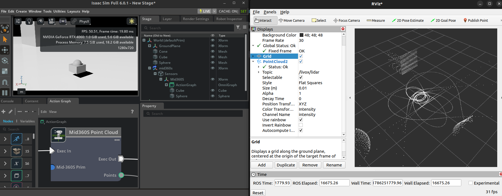
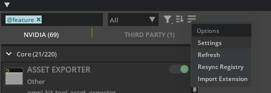
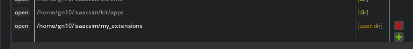
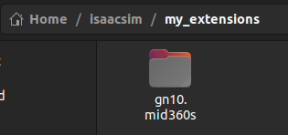
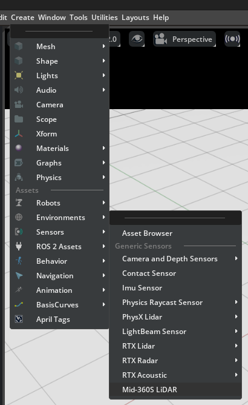
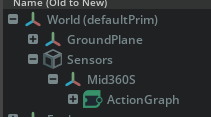
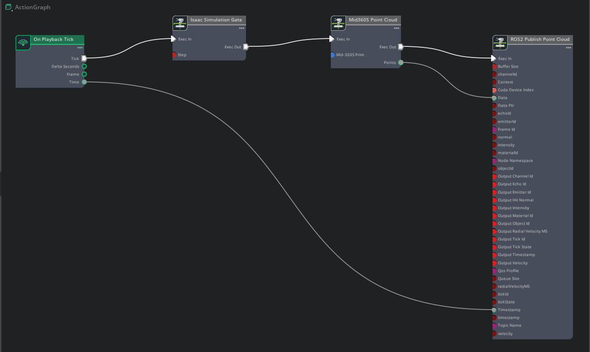
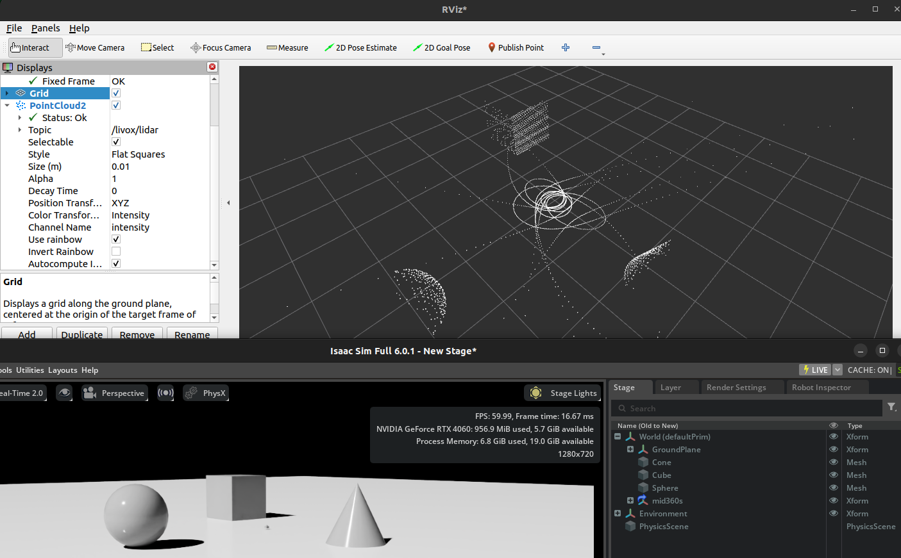

# isaac-sim-mid360s
Isaac Sim Python Extension for Livox Mid-360S LiDAR.



## Requirements
- Ubuntu 22.04
- ROS2 Humble
- Isaac Sim 6.0.1
- GPU with CUDA support (for Isaac Sim, Warp and OmniGraph)

## Installation

Clone this repository into your Isaac Sim extensions directory:
```bash
cd <path_to_isaac_sim_extensions>
git clone https://github.com/tmcit-ararobo-2026a/gn10.mid360s
```

Setup the OmniPerception submodule:
```bash
cd gn10.mid360s
git submodule update --init --recursive
```

Launch Isaac Sim and enable the extension in /Window > Extensions.



Click the "Settings" to open the extension settings.

Add the path to the `gn10.mid360s` extension directory to the "Extension Search Paths" list.



Example: `/home/user/isaacsim/my_extensions/gn10.mid360s`



Then, you can find the gn10.mid360s extension in 

## USD file Usage

If you want to use the Mid-360S LiDAR usd file, you can find it in the `gn10.mid360s/usd/mid360s.usd` file.
You can drag and drop the usd file into the stage to create a Mid-360S LiDAR sensor.

## Usage details

Create a Mid-360S LiDAR sensor in the stage by clicking the /Create > Sensors > Mid-360S LiDAR menu item.



Then, you can see the /World/Sensors/Mid360S prim in the stage.and a ActionGraph created in the /World/Sensors/Mid360S/ActionGraph.



Open the ActionGraph and you can see the Mid360S Point Cloud node.



If you play the simulation, you can subscribe to the point cloud data from ROS2 by subscribing to the `/livox/lidar` topic.

## View Point Cloud in ROS2

Setup ROS2 environment:
```bash
source /opt/ros/humble/setup.bash
```

Publish a static transform from the `map` frame to the `livox_frame` frame:
```bash
ros2 run tf2_ros static_transform_publisher --x 0 --y 0 --z 0 --yaw 0 --pitch 0 --roll 0 --frame-id map --child-frame-id livox_frame
```

Launch the `rviz2` tool to visualize the point cloud data:
```bash
rviz2
```

You can add a PointCloud2 display in rviz2 and set the topic to `/livox/lidar` to visualize the point cloud data from the Mid-360S LiDAR sensor.



## License

The original code in this repository written by Gento Aiba
is distributed under the MIT License.

This project contains code derived from NVIDIA Isaac Sim extension
templates. Those portions remain licensed under the Apache License 2.0
and retain the original NVIDIA copyright notices.

This project includes OmniPerception as a Git submodule.
OmniPerception is a third-party project distributed under the MIT License.
Its original copyright and license notices are retained in the
submodule.

See `LICENSE` and `THIRD_PARTY_LICENSES` for details.